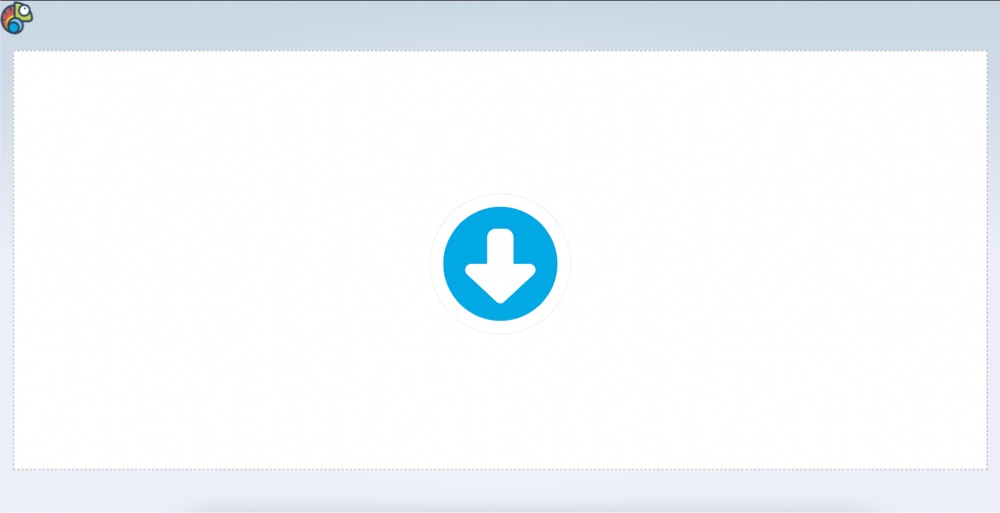

# Cammy

## Table of Contents

- [About](#about)
- [Example](#example)
- [Usage](#usage)
- [Roadmap](#usage)

## About

Video compression application with reactive progress tracking. Websites with long-running processes often don’t provide feedback to users, leading to a poor customer experience. You might have experienced this when booking tickets, searching for hotels, or buying goods online. These sites often call multiple backend and third-party endpoints and aggregate the results to complete your request, causing the delay. In these long running scenarios, a transparent progress tracking solution can create a better user experience.

- AWS Serverless Application Model (AWS SAM) for deployment: an open-source framework for building serverless applications.
- AWS Step Functions for orchestrating the workflow.
- AWS Lambda for long running processes.
- API Gateway to provide a WebSocket API for bidirectional communications between clients and the backend.
- Amazon DynamoDB for storing connection IDs from the clients.
- FFMPEG on Lambda Layer for compression.
- AWS S3 for file storage.
- Svelte for the UI.

## Example

## Usage

1. add here

## Roadmap

- [ ] FFMPEG compression function
- [ ] File upload endpoint
- [ ] Step function workflow start when file uploaded
